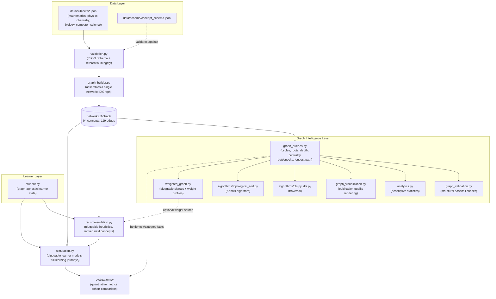

# Project Step Zero

**Optimizing How Students Learn Difficult STEM Concepts**

A computational research framework that models STEM curricula as directed
concept graphs, then uses graph algorithms, weighted scoring, simulated
learners, and quantitative evaluation to ask whether learning pathways can
be systematically improved rather than left to convention.

### At a Glance

| | |
|---|---|
| **Subjects** | 5 (mathematics, physics, chemistry, biology, computer science) |
| **Concepts** | 94, forming a single interconnected graph |
| **Prerequisite edges** | 119, including real cross-subject dependencies |
| **Core modules** | 15 Python modules spanning validation, graph algorithms, recommendation, simulation, and evaluation |
| **Valid learning orderings found** | 10,000+ for the mathematics curriculum alone |

Project Step Zero represents a STEM curriculum as an explicit,
machine-readable graph rather than an implicit syllabus, then builds a
full computational pipeline on top of that graph: schema validation,
hand-implemented graph algorithms, a configurable weighted recommendation
engine, a deterministic learning simulator, and a quantitative evaluation
layer that turns simulated learning journeys into reproducible evidence.
The result is a working system that has already produced several concrete
findings about curriculum structure, not just a framework that could,
in theory, produce them someday.

---

## Table of Contents

- [Project Overview](#project-overview)
- [Research Motivation](#research-motivation)
- [Key Contributions](#key-contributions)
- [Architecture](#architecture)
- [Features](#features)
- [Current Project Status](#current-project-status)
- [Folder Structure](#folder-structure)
- [Installation](#installation)
- [Quick Start](#quick-start)
- [CLI Commands](#cli-commands)
- [Example Outputs](#example-outputs)
- [Future Roadmap](#future-roadmap)
- [Technologies Used](#technologies-used)

---

## Project Overview

Most curricula are built on intuition. A textbook's table of contents, a
teacher's sense of what comes next, a syllabus that has looked roughly
the same for decades. Project Step Zero starts from a different premise:
that a STEM curriculum is, underneath all of that, a mathematical object.
Concepts depend on other concepts in a structured way, and that structure
can be represented explicitly, as a directed acyclic graph, and then
studied with the same tools used to study any other graph: traversal,
centrality, optimization, simulation.

The project currently spans five interconnected subject graphs
(mathematics, physics, chemistry, biology, and computer science, 94
concepts in total) and a full software stack built on top of that single
representation: schema-validated curriculum data, a hand-built graph
algorithms layer, a configurable weighting and recommendation engine, a
deterministic learning simulator with pluggable learner models, and a
metrics layer that turns simulated learning journeys into reproducible,
comparable evidence.

Nothing here is a toy exercise dressed up as research. Every module has
been tested against real, generated data before being trusted, and
several genuine bugs and design tensions were caught and fixed by
actually running the system rather than by reading the code and assuming
it worked. See [Example Outputs](#example-outputs) for two concrete cases
where that mattered.

## Research Motivation

Why build this at all? Because the question underneath it, whether a
curriculum's structure can be made explicit and then optimized, is not a
solved problem, and answering it computationally rather than
anecdotally has real consequences: for how much flexibility students
actually have in the order they learn things, for which concepts quietly
become bottlenecks that an entire subject depends on, and for whether a
recommendation strategy that sounds reasonable on paper actually produces
good outcomes when it's run forward as a simulated learning journey
instead of just asserted.

This project answers each of those questions directly, with numbers, not
just in principle:

- Is there a single correct order to learn a curriculum, or does it have
  real structural flexibility? The topological sort engine found over
  10,000 distinct valid orderings for the 35-concept mathematics
  curriculum alone, with 31 explicit points where more than one concept
  was simultaneously available to learn next.
- Which concepts are genuine structural bottlenecks, single points that
  most learning paths are forced through, as opposed to concepts that are
  merely well-connected but easily bypassed? The graph algorithms layer
  answers this precisely, using articulation points, not just intuition
  about which topics "feel important."
- Does a plausible, hand-authored recommendation strategy actually
  produce sensible learning outcomes when it is run forward as a full
  simulated learning journey, and how do different learner profiles and
  weighting philosophies compare against each other? The simulation and
  evaluation layers make this measurable rather than a matter of opinion.
- Does any of this generalize beyond a single subject, or does treating a
  curriculum as a graph only work for an isolated syllabus? Five subject
  files now merge into one interconnected, single-component graph, with
  real cross-subject prerequisites: a physics concept genuinely depending
  on a calculus concept, biology depending on chemistry, and so on.

The project also connects naturally to broader independent computational
STEM work already underway (Vertex Ed, Quantum Sandbox), and is intended
to grow into a research paper in its own right. Studying how learning
itself can be improved, using the tools of graph theory, algorithms, and
optimization, is the actual point of this project, not a side effect of
it.

## Key Contributions

- A fully interconnected, five-subject STEM knowledge graph (94 concepts,
  119 edges) with real, academically justified cross-subject
  prerequisites, not five disconnected syllabi that happen to share a
  folder.
- Hand-implemented core graph algorithms, a three-color DFS cycle
  detector and Kahn's algorithm for topological sorting, chosen
  deliberately for algorithmic depth over a convenience library call.
- A pluggable, strategy-based architecture (independent Heuristic,
  LearnerModel, and Signal classes) that lets new recommendation logic,
  learner archetypes, or weighting philosophies be added without
  modifying the systems that use them.
- A complete simulation-to-evaluation pipeline that turns a
  recommendation strategy into a measurable, reproducible outcome rather
  than an untested assumption.
- Deterministic design throughout, from graph layout to simulated
  learners, so that every experiment can be exactly reproduced from its
  inputs and a seed.
- Several concrete, verified findings the system has already produced on
  its own, including genuine curriculum ordering flexibility and a
  previously unpredicted interaction between the mastery threshold and
  the smoothing model (see [Example Outputs](#example-outputs)).

## Architecture

Data flows in one direction through the system. Curriculum JSON is
validated, assembled into a single graph, and every layer built on top of
that graph (queries, recommendation, simulation, evaluation) only ever
reads it, never mutating it or the files it came from.



> **[Screenshot placeholder: architecture diagram]**
> A static, exported rendering of the flowchart above, for viewers or
> exports that do not support Mermaid, will be added here.

A few principles hold this whole structure together, and are enforced
everywhere, not just in one or two places:

Every module above `graph_builder.py` treats the graph as read only, and
every module above `student.py` treats a learner's state as something to
be updated only through its own public methods, never reached into
directly. Facts that matter in more than one place are computed exactly
once: `graph_queries.effective_importance()`, for example, is the single
source of truth for "importance or centrality fallback," and both the
visualization module and the weighting module call it rather than each
keeping a private copy that could quietly drift out of sync. Randomness
is never left to chance. The hierarchical graph layout, the tie-breaking
in Kahn's algorithm, and every simulated learner all rely on fixed seeds
or alphabetical tie-breaks rather than Python's global random state, so
identical inputs always reproduce identical outputs. And ranking logic is
never hard-coded: recommendation heuristics, learner archetypes, and
weighting philosophies are all small, swappable strategy classes, so new
ones can be added without touching the code that uses them.

## Features

### Data Layer

Schema-validated curriculum data sits at the foundation: a formal JSON
Schema together with a two-layer validator, structural and referential,
catches malformed data, duplicate ids, and dangling references long
before they could ever reach the graph. On top of that sits a genuinely
interconnected curriculum: five subject files merge into one 94-concept
DAG, with real academic cross-subject edges rather than five disconnected
islands that happen to share a folder.

### Graph Algorithms

The core graph algorithms are hand-implemented, not just thin wrappers
around a library call: a three-color DFS cycle detector, iterative
BFS and DFS traversal, and Kahn's algorithm for topological sorting, each
chosen deliberately for its teaching value over a one-line substitute.

### Recommendation

A configurable weighting framework combines five pluggable signals,
importance, difficulty, study time, prerequisite strength, and mastery,
through named, swappable profiles like balanced, fast track, and
thorough, with full normalization and explicit handling of missing data.
A graph-agnostic student model tracks mastery, attempt history, and full
serialization, with exactly one deliberate bridge into the graph itself,
a function that answers what is structurally unlocked without ever
ranking or recommending anything.

The recommendation engine itself is built from independent, explainable
heuristics, conceptual importance, prerequisite readiness, difficulty,
study time, and how much future learning a concept unlocks, each
contributing its own score and a plain-language reason a person could
actually read and trust.

### Simulation

A deterministic learning simulator runs the recommendation engine forward
across three pluggable learner archetypes, average, fast, and struggling,
with full session-by-session logging and a safety valve that forces
progression on a stubborn concept rather than looping forever, always
flagged explicitly when it happens rather than hidden.

### Evaluation

A quantitative evaluation layer turns those simulated journeys into real
evidence: completion rate, forced completion rate, one-shot mastery rate,
bottleneck completion, recommendation diversity, category coverage, and a
general comparison function for benchmarking different heuristics,
learner models, or weighting philosophies directly against each other.

### Visualization

Visualization is built to the standard of an actual figure, not a debug
plot: a deterministic, depth-based hierarchical layout rather than a
force-directed mess, with category coloring, importance-scaled node
sizes, and optional highlighting of the longest prerequisite chain and
the graph's structural bottlenecks.

---

Every module ships with its own command-line interface for direct,
hands-on experimentation. See [CLI Commands](#cli-commands).

## Current Project Status

The system, as it stands, is a complete and internally validated
computational pipeline: every checked item above has been built, tested
against real generated data, and in several cases has already surfaced
genuine findings (see [Example Outputs](#example-outputs)). The unchecked
items are the natural next phase, not missing pieces the current system
depends on.

## Folder Structure

```
Project Step Zero/
│
├── README.md
├── requirements.txt
├── .gitignore
│
├── docs/
│   └── SCHEMA_DESIGN.md              (concept schema design rationale)
│
├── data/
│   ├── schema/
│   │   └── concept_schema.json       (formal JSON Schema for subject files)
│   └── subjects/
│       ├── mathematics.json          (35 concepts, 42 edges)
│       ├── physics.json              (15 concepts, 19 edges)
│       ├── chemistry.json            (14 concepts, 17 edges)
│       ├── biology.json              (14 concepts, 17 edges)
│       └── computer_science.json     (16 concepts, 24 edges)
│
├── stepzero/                         (the core Python package)
│   ├── __init__.py
│   ├── validation.py                 (JSON Schema and referential validation)
│   ├── graph_builder.py              (assembles JSON into a networkx.DiGraph)
│   ├── graph_queries.py              (shared, pure graph algorithms)
│   ├── graph_validation.py           (structural pass/fail judgment)
│   ├── analytics.py                  (descriptive statistics)
│   ├── graph_visualization.py        (publication quality rendering)
│   ├── student.py                    (graph-agnostic learner model)
│   ├── recommendation.py             (pluggable-heuristic recommender)
│   ├── weighted_graph.py             (weighting and optimization layer)
│   ├── simulation.py                 (learning journey simulator)
│   ├── evaluation.py                 (metrics and experiment comparison)
│   │
│   └── algorithms/
│       ├── __init__.py
│       ├── common.py                 (shared traversal direction and neighbor lookup)
│       ├── bfs.py                    (breadth-first search)
│       ├── dfs.py                    (depth-first search)
│       └── topological_sort.py       (Kahn's algorithm)
│
├── visualizations/                   (generated PNG output, git-ignorable)
│
└── notebooks/
    └── graph_experiments.ipynb
```

## Installation

Requires Python 3.11 or newer (the codebase uses modern type-hint syntax
like `str | None` throughout).

```bash
# Clone or navigate to the project directory
cd "Project Step Zero"

# Create and activate a virtual environment
python3 -m venv .venv
source .venv/bin/activate        # Windows: .venv\Scripts\activate

# Install dependencies
pip install -r requirements.txt
```

`requirements.txt` should contain:

```
networkx
matplotlib
jsonschema
```

## Quick Start

```python
from stepzero.graph_builder import build_graph
from stepzero.student import Student
from stepzero.recommendation import recommend_next, format_recommendations

# Builds one combined graph from every file in data/subjects/
graph = build_graph()
print(f"{graph.number_of_nodes()} concepts, {graph.number_of_edges()} edges")

# Create a learner and record some progress
student = Student(student_id="s001", name="Ada")
student.start_concept("mathematics.arithmetic.number_sense")
student.record_attempt("mathematics.arithmetic.number_sense", score=0.9, time_spent_hours=1.0)
student.mark_mastered("mathematics.arithmetic.number_sense")

# Ask the recommendation engine what to study next
recommendations = recommend_next(graph, student, top_n=3)
print(format_recommendations(recommendations, graph))
```

To simulate a full learning journey and measure the outcome:

```python
from stepzero.simulation import LearningSimulator, SimulationConfig, AverageLearnerModel
from stepzero.evaluation import evaluate_simulation, summarize_metrics

student = Student(student_id="sim1", name="Simulated Learner")
simulator = LearningSimulator(
    learner_model=AverageLearnerModel(),
    config=SimulationConfig(max_sessions=400, seed=42),
)
result = simulator.run(graph, student)

metrics = evaluate_simulation(result, graph)
print(summarize_metrics(metrics))
```

## CLI Commands

Every module can be run directly for experimentation. All commands assume
you are in the project root with the virtual environment activated.

| Command | Purpose |
|---|---|
| `python -m stepzero.validation data/subjects/mathematics.json` | Validate a single subject file |
| `python -m stepzero.graph_builder` | Build the combined graph, print node and edge counts |
| `python -m stepzero.graph_validation` | Run full structural validation (cycles, roots, isolated nodes) |
| `python -m stepzero.analytics` | Print descriptive statistics, centrality, longest chain |
| `python -m stepzero.graph_visualization` | Render the graph to `visualizations/concept_graph.png` |
| `python -m stepzero.algorithms.bfs <concept_id> --direction dependents\|prerequisites\|both` | Run breadth-first traversal from a concept |
| `python -m stepzero.algorithms.dfs <concept_id> --direction dependents\|prerequisites\|both` | Run depth-first traversal from a concept |
| `python -m stepzero.algorithms.topological_sort --show-alternatives 5 --count` | Compute a valid learning order and show alternatives |
| `python -m stepzero.student` | Run the built-in student model demo |
| `python -m stepzero.recommendation --top-n 5 --weights-file weights.json` | Get ranked next-concept recommendations |
| `python -m stepzero.weighted_graph --compare --top-n 10` | Compare concept rankings under different weight profiles |
| `python -m stepzero.simulation --learner-model fast --max-sessions 400 --output-file run.json` | Simulate a full learning journey |
| `python -m stepzero.evaluation run1.json run2.json run3.json` | Evaluate one or more saved simulation runs, individually and as a cohort |

## Example Outputs

> **[Screenshot placeholder: combined STEM concept graph]**
> The full 94-concept, five-subject interconnected graph
> (`visualizations/combined_stem_graph.png`), rendered with category
> coloring, a depth-based hierarchical layout, and cross-subject
> prerequisite edges, will be added here.

Topological sorting reveals real curriculum flexibility, not a single
rigid order:

```
Ordering is unique: False
Choice points: 31
  At step 2, any of: Variables and Expressions, Euclidean Geometry Basics,
  Descriptive Statistics, Probability Basics
...
Total valid orderings: 10,000+ (capped)
```

> **[Screenshot placeholder: recommendation example]**
> A terminal screenshot of `python -m stepzero.recommendation` producing
> the ranked output below will be added here.

A recommendation with a transparent, auditable explanation:

```
1. Variables and Expressions  (mathematics.algebra.variables_expressions)  score: 0.507
     - Difficulty rated 1/5 (easier concepts score higher, to build early momentum).
     - Completing this would directly unlock 2 other concept(s).
     - Estimated at 3h (shortest among current candidates scores highest).
```

> **[Screenshot placeholder: simulation output]**
> A terminal screenshot of `python -m stepzero.simulation` running a full
> learning journey will be added here.

A real, unplanned research finding, caught by actually running a
simulation rather than by reading the code and assuming it worked: even a
consistently strong, 0.89-scoring simulated learner needs seven attempts
before crossing the mastery threshold, purely because of the mastery
model's smoothing dynamics, entirely independent of how difficult the
concept actually is. This was verified by hand-computing the smoothing
sequence, not assumed:

```
Attempt 6: mastery_score = 0.785
Attempt 7: mastery_score = 0.817  >= threshold
```

Cross-subject interconnection, verified structurally rather than just
claimed: after adding physics, chemistry, biology, and computer science,
the single longest prerequisite chain in the entire 94-concept system
crosses a subject boundary outright.

```
mathematics.arithmetic.number_sense -> ... -> mathematics.calculus.differential_equations_intro
  -> physics.mechanics.orbital_mechanics
```

Different weighting philosophies genuinely diverge, not just numerically
but in which concepts they actually favor:

```
Concept                          balanced     fast_track       thorough
Number Sense                        0.617          0.859          0.379
Matrices                            0.525          0.457          0.657
```

## Future Roadmap

Directly ahead, following the project's original plan: an adaptive
learning engine that replaces the recommendation engine's hand-picked
heuristic weights, and the student model's placeholder smoothing formula,
with something actually learned from simulated or real outcomes, Bayesian
knowledge tracing being one clear candidate, flagged as a future
possibility in the schema design documentation since the very first
design pass. An interactive dashboard, likely Streamlit or something
similar, built over the data layer exactly as it already stands, since no
core module should need to change to support a front end; that separation
was deliberate from day one. And, eventually, a formal research paper
that synthesizes what this system has already found: real curriculum
ordering flexibility, genuine structural bottlenecks, an interaction
effect between the mastery threshold and the smoothing model that no one
would have predicted from reading the code alone, and a working,
cross-subject knowledge graph, into a coherent written argument.

A few further ideas surfaced naturally while building this system, and
are worth pursuing even though they are not yet scheduled: authoring real
prerequisite strength and edge type values (currently defaulted uniformly
across all five subject files, and the weighting framework is already
built to use this data the moment it exists), expanding each subject file
from its current proof-of-concept scale toward a fuller syllabus, a
dedicated optimization module that goes beyond single-step recommendation
to plan a full multi-session study path against a time or session budget,
and a proper persistence layer for student profiles, since serialization
already exists but no storage convention has been decided yet.

## Technologies Used

Python 3.11 or newer, using dataclasses, enums, and modern union type
hints throughout. NetworkX provides the underlying directed graph
representation, alongside a deliberately small number of library calls
(topological sort inside the shared query layer, articulation points,
betweenness centrality) used next to, not instead of, hand-written
algorithms wherever the hand-written version has real teaching value:
cycle detection, BFS and DFS, and Kahn's algorithm. Matplotlib handles
publication-quality static rendering, and jsonschema provides formal
validation against the concept schema. The rest is standard library:
argparse for every command-line interface, heapq for deterministic
tie-breaking in Kahn's algorithm, dataclasses for every structured result
object, statistics for cohort-level variance, and zlib for stable,
cross-process seed derivation in the simulator, which deliberately avoids
Python's own randomized string hashing.