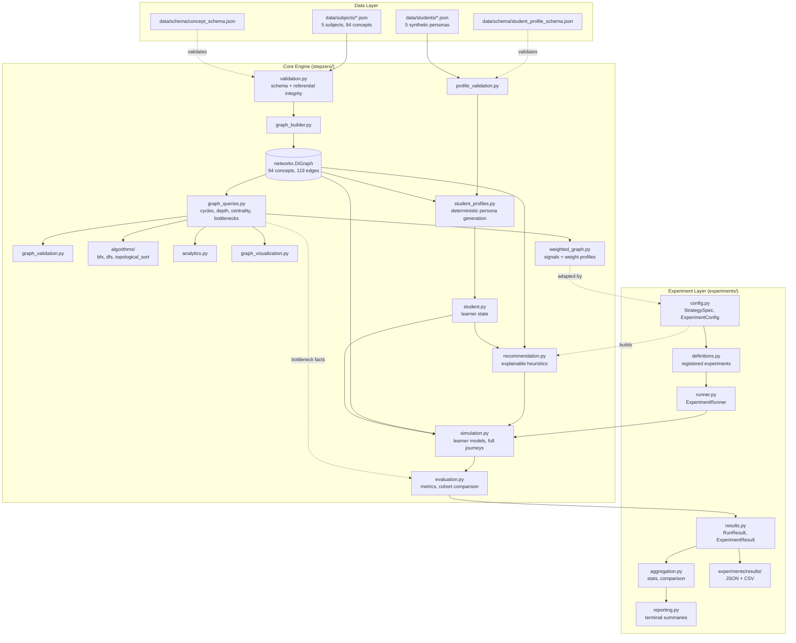

# Project Step Zero

Optimizing How Students Learn Difficult STEM Concepts

Most curricula are ordered by convention: a textbook's table of contents, a
department's habit, a syllabus that has looked roughly the same for decades.
Project Step Zero starts from a different premise, that a STEM curriculum is
underneath all of that a mathematical object. Concepts depend on other concepts
in a structured way, that structure can be written down explicitly as a directed
acyclic graph, and it can then be studied with the tools used on any other graph:
traversal, centrality, ordering, optimization, simulation.

The repository contains a working computational pipeline built on that idea:
schema-validated curriculum data for five interconnected STEM subjects,
hand-implemented graph algorithms, a configurable weighted recommendation
engine, deterministic synthetic learner profiles, a learning simulator, a
quantitative evaluation layer, and an experiment framework that runs controlled,
reproducible comparisons across all of it. Version 1.0 is intended as a stable
computational baseline: the fixed reference point against which later empirical
work can be measured.

### At a Glance

| | |
|---|---|
| Subjects | 5 (mathematics, physics, chemistry, biology, computer science) |
| Concepts | 94, forming a single weakly connected graph |
| Prerequisite edges | 119, of which 16 cross a subject boundary |
| Structural bottlenecks | 22 articulation points |
| Longest prerequisite chain | 12 concepts, crossing from mathematics into physics |
| Core engine modules | 17, plus 7 in the experiment layer |
| Synthetic learner profiles | 5 deterministic research personas |
| Registered experiments | 5, covering 355 configured runs in total |
| Automated tests | 441, all passing |

---

## Table of Contents

- [Project Overview](#project-overview)
- [Research Motivation](#research-motivation)
- [Key Contributions](#key-contributions)
- [Architecture](#architecture)
- [Features](#features)
- [Current Project Status](#current-project-status)
- [Current Limitations](#current-limitations)
- [Folder Structure](#folder-structure)
- [Installation](#installation)
- [Quick Start](#quick-start)
- [CLI Commands](#cli-commands)
- [Reproducible Experiments](#reproducible-experiments)
- [Example Outputs and Findings](#example-outputs-and-findings)
- [Future Roadmap](#future-roadmap)
- [Technologies Used](#technologies-used)
- [Testing](#testing)
- [Citation](#citation)

---

## Project Overview

Project Step Zero represents a STEM curriculum as an explicit, machine-readable
graph rather than an implicit syllabus, then builds a full computational stack on
top of that single representation.

The curriculum layer is five subject files that merge into one 94-concept
directed acyclic graph with 16 genuine cross-subject prerequisites, so physics
depends on calculus, biology depends on chemistry, and computer science depends
on arithmetic and algebra. Every file is validated against a formal JSON Schema
and a referential integrity pass before it reaches the graph.

Above that sit the analysis and decision layers: hand-written cycle detection,
traversal and topological sorting; descriptive analytics and centrality; a
learner model that tracks partial mastery and attempt history; a weighting
framework with swappable signal profiles; and an explainable recommendation
engine that ranks what a given learner should study next.

Above that sits the experimental layer: a deterministic simulator that runs a
recommendation strategy forward into a full learning journey, an evaluation layer
that turns those journeys into quantitative metrics, and an experiment framework
that runs controlled grids across profiles, strategies, learner models, and
seeds, then aggregates and compares the results.

The distinction that matters throughout: this system produces structural findings
about curriculum graphs and behavioural findings about simulated learners. It
does not yet produce evidence about real students. Keeping those categories
separate is a design goal, not an afterthought.

## Research Motivation

The question underneath the project, whether a curriculum's structure can be made
explicit and then studied quantitatively, is not settled, and answering it
computationally rather than anecdotally has consequences: for how much freedom
students actually have in the order they learn things, for which concepts quietly
become bottlenecks an entire subject depends on, and for whether a recommendation
strategy that sounds reasonable on paper survives being run forward and measured.

The system addresses each of these directly and with numbers.

| Question | How the system answers it |
|---|---|
| Is there one correct order to learn a curriculum? | Topological sorting enumerates valid orderings and records every point where more than one concept is simultaneously available |
| Which concepts are genuine structural bottlenecks? | Articulation point analysis, rather than intuition about which topics feel important |
| Does a plausible recommendation strategy actually behave well? | The simulator runs it forward; the evaluation layer measures the outcome |
| Does any of this survive beyond one subject? | Five subject files merge into a single connected graph with real cross-subject prerequisites |
| Is an observed difference between strategies real or noise? | The experiment layer reports effect spread against the spread inside each comparison group |

That last row is the reason the experiment layer exists. Comparing two strategies
once, on one profile, with one seed, produces a number that looks like a finding
and usually is not.

## Key Contributions

- A fully interconnected five-subject STEM knowledge graph (94 concepts, 119
  edges, 16 of them cross-subject), rather than five disconnected syllabi that
  happen to share a folder.
- Hand-implemented core graph algorithms: a three-color DFS cycle detector,
  iterative BFS and DFS, and Kahn's algorithm with deterministic tie-breaking,
  chosen for algorithmic depth over a convenience library call.
- A pluggable, strategy-based architecture. Heuristic, Signal, and LearnerModel
  are independent classes, so new recommendation logic, weighting philosophies,
  or learner archetypes can be added without modifying the code that consumes
  them.
- Five deterministic synthetic learner profiles with heterogeneous strengths,
  partial mastery, prerequisite-aware coherence, and deliberately documented
  exceptions (forgotten knowledge, crammed topics, blind spots).
- A complete simulation-to-evaluation pipeline that converts a recommendation
  strategy into a measurable, reproducible outcome.
- An experiment framework that runs controlled grids, preserves every individual
  run, and reports effect size against within-group spread so that null results
  are visible as null results.
- Determinism throughout: fixed seeds, alphabetical tie-breaks, and stable
  cross-process hashing, so identical inputs reproduce identical results. The one
  exception is wall-clock timestamps recorded in a learner's event history.

## Architecture

Data flows in one direction. Curriculum JSON is validated and assembled into a
single graph, and every layer above that graph reads it without mutating it or
the files it came from. The experiment layer sits on top of the engine and calls
its public APIs only; it contains no learning logic of its own.



Four principles are enforced everywhere, not just in one or two places.

Read-only discipline: every module above `graph_builder.py` treats the graph as
immutable, and every module above `student.py` updates learner state only through
its public methods. Single source of truth: facts used in more than one place are
computed once, so `graph_queries.effective_importance()` backs both visualization
and weighting rather than each keeping a copy that can drift. Determinism by
construction: layout, Kahn tie-breaking, persona generation, and simulated
learners all use fixed seeds, alphabetical ordering, or stable CRC-based hashing
instead of Python's global random state. Strategy over hard-coding: heuristics,
signals, learner models, and weight profiles are swappable classes.

## Features

### Data Layer

A formal JSON Schema plus a two-layer validator (structural, then referential)
catches malformed data, duplicate ids, dangling references, and self-loops before
anything reaches the graph. A second schema governs student profile files. The
curriculum schema treats `id`, `name`, `subject`, `description`, `difficulty`, and
`estimated_study_hours` as required, with optional fields for importance,
educational level, tags, learning objectives, examples, and references.

### Knowledge Graph

Five subject files merge into one `networkx.DiGraph` of 94 concepts and 119
edges. Duplicate ids across files and edges referencing concepts that no file
defines are both build-time errors. The result is a single weakly connected
component with 4 roots, 29 leaves, 22 articulation points, and a maximum
prerequisite depth of 11.

| Subject | Concepts | Edges | Cross-subject edges |
|---|---|---|---|
| mathematics | 35 | 42 | 0 |
| computer_science | 16 | 24 | 4 |
| physics | 15 | 19 | 6 |
| chemistry | 14 | 17 | 3 |
| biology | 14 | 17 | 3 |
| Total | 94 | 119 | 16 |

### Graph Algorithms

Cycle detection is a hand-written three-color DFS that returns the actual cycle
rather than a boolean. BFS and DFS are iterative, support three traversal
directions (prerequisites, dependents, both), and expose distances, discovery and
finish times, and path reconstruction. Topological sorting is Kahn's algorithm
with a heap for deterministic alphabetical tie-breaking, and it records every
choice point where more than one concept was simultaneously available, plus
utilities to enumerate and count alternative valid orderings.

### Learner Model

`student.py` is deliberately graph-agnostic. It tracks per-concept status,
partial mastery on a unit interval, attempt counts, time spent, self-rated
confidence, and three timestamps, alongside a full event history. Mastery updates
through exponential smoothing. It has exactly one bridge into the graph,
`eligible_concepts()`, which answers what is structurally unlocked without
ranking or recommending anything.

### Synthetic Student Profiles

Five research personas (beginner, intermediate, advanced, struggling, exam
focused) are generated deterministically from declarative `PersonaSpec`
definitions and committed as `Student.to_dict()` JSON, so they load through the
existing deserializer. Mastery derives from prerequisite depth, per-category
affinities, and CRC-seeded jitter, with four kinds of documented exception:
gaps, bright spots, forgotten knowledge, and crammed topics.

| Profile | Concepts touched | Mastered | Average mastery | Logged events |
|---|---|---|---|---|
| advanced_student | 59 | 52 | 0.848 | 196 |
| exam_focused_student | 46 | 12 | 0.555 | 157 |
| intermediate_student | 33 | 8 | 0.659 | 124 |
| struggling_student | 25 | 4 | 0.485 | 158 |
| beginner_student | 23 | 4 | 0.602 | 91 |

Every profile file carries a required `synthetic: true` flag and a disclaimer in
its metadata, enforced by the schema, so a generated persona cannot be mistaken
for observed data.

### Weighting

Five pluggable signals (importance, difficulty, study time, prerequisite
strength, mastery) are combined through named weight profiles: balanced, fast
track, and thorough. Normalization handles fixed bounds, clamping, constant-value
inputs, and missing data explicitly, and every score records which signals
contributed and which were unavailable.

### Recommendation

The recommender ranks eligible concepts using five independent heuristics:
conceptual importance, prerequisite readiness, difficulty, study time, and how
much future learning a concept unlocks. Each contributes a score and a
plain-language reason, so a recommendation can be audited rather than trusted.
Ranking is deterministic, with ties broken on concept id.

### Simulation

A deterministic simulator runs the recommender forward across three learner
archetypes (average, fast, struggling), logging every session. It stops for one
of four recorded reasons: curriculum complete, max sessions reached, time budget
exhausted, or no eligible concepts. After `max_attempts_per_concept` attempts
(default 10) a concept is marked mastered even if the threshold was not reached,
and every such forced completion is flagged explicitly. Under the default
settings this is a primary progression mechanism, not a rare safety valve; see
[Current Limitations](#current-limitations).

### Evaluation

`evaluation.py` converts simulated journeys into metrics: completion and coverage
rate, final average mastery, mastery growth rate, hours and attempts per concept,
forced completion rate, one-shot mastery rate, candidate pool size,
recommendation diversity, bottleneck completion, and per-category completion. It
also aggregates cohorts and compares named experiment groups. Every metric used
anywhere else in the project comes from this module; nothing reimplements one.

### Experiment Infrastructure

The `experiments/` package turns the engine from a set of modules into a platform
for systematic computational experimentation. It defines controlled grids across
the full cross product of student profiles, recommendation strategies, weighting
profiles, learner models, and random seeds, then executes them, stores structured
results, and aggregates comparisons.

| Component | Responsibility |
|---|---|
| `config.py` | `StrategySpec`, `RunSpec`, `ExperimentConfig`, grid expansion, heuristic registry |
| `definitions.py` | The registered experiments and `register_experiment()` |
| `runner.py` | `ExperimentRunner`, per-run isolation, failure containment, provenance metadata |
| `results.py` | `RunResult` and `ExperimentResult`, JSON save and load, CSV export |
| `aggregation.py` | Descriptive statistics, grouping, strategy comparison |
| `reporting.py` | Human-readable terminal summaries |

Why this matters scientifically: a single simulation run is an anecdote. The
experiment layer makes the unit of analysis a grid rather than a run, keeps every
individual run rather than only averages, and reports the spread between groups
next to the mean within-group standard deviation. When that ratio falls below
1.0, the summary states plainly that the difference is smaller than the spread
inside the groups. Note that a group spans every factor it does not name: grouping
only by strategy mixes seed variation with between-profile variation, so the
ratio is conservative. Group by `strategy_name` and `profile_id` for a
within-profile comparison.

Weight profiles and recommendation heuristics use different vocabularies, since
`WeightProfile` scores signals for `WeightedGraph` while `Recommender` scores
heuristics, and nothing in the engine connected the two. `strategy_from_weight_profile()`
is the documented adapter that makes weight profiles runnable in a simulation.
It is a modelling choice made by the experiment layer, recorded in every derived
strategy via `derived_from_weight_profile`, and described in
[experiments/README.md](experiments/README.md).

### Visualization

`graph_visualization.py` renders to `visualizations/concept_graph.png` using a
deterministic depth-based hierarchical layout rather than a force-directed
tangle, with category coloring, importance-scaled node sizes, and optional
highlighting of the longest prerequisite chain and structural bottlenecks.

## Current Project Status

Version 1.0 is a complete and internally validated computational baseline.

Completed:

- Five interconnected STEM curriculum datasets with a formal schema
- Two-layer curriculum validation (structural and referential)
- Graph construction with duplicate and dangling-reference detection
- Hand-implemented cycle detection, BFS, DFS, and Kahn's topological sort
- Graph queries, structural validation, and descriptive analytics
- Graph-agnostic student model with serialization
- Five deterministic synthetic learner profiles, with their own schema and validator
- Weighting framework with pluggable signals and named profiles
- Explainable recommendation engine
- Deterministic simulator with three learner archetypes
- Quantitative evaluation and cohort comparison
- Experiment infrastructure with structured results, aggregation, and a CLI
- Automated test suite, 441 tests, all passing
- Deterministic visualization

Not yet started or deliberately deferred:

- Primary research and empirical validation against real learners
- Adaptive learning driven by parameters learned from data rather than authored
- Interactive dashboard (Streamlit or equivalent)
- Full-scale curriculum expansion beyond proof-of-concept subject files
- Authored edge metadata (prerequisite strength and edge type)
- Research paper

## Current Limitations

These are stated plainly because the credibility of later empirical work depends
on being precise now about what the current system does and does not show.

Learner profiles are synthetic research personas, not real student data. They are
designed to stress-test the framework, and every profile file is required by
schema to declare `synthetic: true` alongside a disclaimer. No part of this
repository contains observed data from any real learner.

Difficulty and study-time values are authored, not measured. All 94 concepts
carry a hand-assigned `difficulty` (1 to 5) and `estimated_study_hours`. These
are informed estimates, not empirical measurements.

Importance is authored for a minority of concepts. Only 14 of 94 concepts carry
an explicit `importance` value; the remaining 80 fall back to degree centrality
through `effective_importance()`. The two are on very different scales: authored
values run from 0.85 to 0.95, while the centrality fallback runs from 0.011 to
0.065. The importance heuristic and signal therefore act almost as a flag for
those 14 hand-picked concepts rather than as a graded measure.

Edge metadata is entirely defaulted. None of the 119 edges carries an authored
`strength`, `type`, `confidence`, or `notes` value, so all prerequisites are
currently treated as uniformly required at full strength. The weighting framework
already reads this data and will use it the moment it exists.

Weighting strategies are designed, not learned. The balanced, fast track, and
thorough profiles encode plausible teaching philosophies chosen by hand. Nothing
in the system currently fits weights to outcomes.

Learner models are simplified. Three archetypes generate scores from concept
difficulty plus Gaussian noise, and mastery accumulates through a fixed
exponential smoothing constant. This is a deliberately transparent placeholder,
not a cognitive model, and it has measurable side effects (see the smoothing
finding below).

Forced completion drives most simulated progress. With the default mastery
threshold (0.8), smoothing constant (0.3), and 10-attempt cap, the average learner's
expected score falls below the threshold from difficulty 3 upward, and the struggling
learner's never reaches it. Over full simulated journeys, about 81 percent of the
average learner's completions and all of the struggling learner's are forced; in the
recorded 120-session experiments the forced share is roughly 44 to 49 percent. Because
almost every concept costs close to the same number of sessions, outcomes such as
completion rate are only weakly sensitive to recommendation order. Simulation results
should be read with this in mind.

Several metrics count only what happens inside a simulation. `completion_rate`,
`bottleneck_completion_rate`, and `one_shot_mastery_rate` count concepts newly mastered
during the run and ignore a profile's prior mastery, while `coverage_rate` includes
concepts the profile had already touched. Values are therefore not comparable across
profiles with different starting states, only across strategies on the same profile.

The datasets are proof-of-concept, not exhaustive curricula. Ninety-four concepts
across five subjects is enough to exhibit real cross-subject structure, and far
short of a full syllabus in any one of them.

Structural findings and learning claims are different things. Results about graph
shape (ordering flexibility, bottlenecks, chain length) are properties of the
authored graph and hold exactly as stated. Results from simulation are properties
of the simulated learner model interacting with the recommender, and say nothing
directly about how real students learn. Nothing in this repository demonstrates
improved educational outcomes.

## Folder Structure

```
Project Step Zero/
│
├── README.md
├── requirements.txt
├── pytest.ini
├── .gitignore
│
├── docs/
│   └── SCHEMA_DESIGN.md                    (concept schema design rationale)
│
├── data/
│   ├── schema/
│   │   ├── concept_schema.json             (JSON Schema for subject files)
│   │   └── student_profile_schema.json     (JSON Schema for learner profiles)
│   ├── subjects/
│   │   ├── mathematics.json                (35 concepts, 42 edges)
│   │   ├── computer_science.json           (16 concepts, 24 edges)
│   │   ├── physics.json                    (15 concepts, 19 edges)
│   │   ├── chemistry.json                  (14 concepts, 17 edges)
│   │   └── biology.json                    (14 concepts, 17 edges)
│   └── students/
│       ├── advanced_student.json           (generated synthetic personas)
│       ├── beginner_student.json
│       ├── exam_focused_student.json
│       ├── intermediate_student.json
│       └── struggling_student.json
│
├── stepzero/                               (core computational engine)
│   ├── __init__.py
│   ├── validation.py                       (schema and referential validation)
│   ├── graph_builder.py                    (assembles JSON into a networkx.DiGraph)
│   ├── graph_queries.py                    (shared pure graph algorithms)
│   ├── graph_validation.py                 (structural pass/fail judgment)
│   ├── analytics.py                        (descriptive statistics)
│   ├── graph_visualization.py              (deterministic rendering)
│   ├── student.py                          (graph-agnostic learner model)
│   ├── student_profiles.py                 (persona definitions and generation)
│   ├── profile_validation.py               (profile schema and coherence checks)
│   ├── recommendation.py                   (pluggable-heuristic recommender)
│   ├── weighted_graph.py                   (signals and weight profiles)
│   ├── simulation.py                       (learning journey simulator)
│   ├── evaluation.py                       (metrics and cohort comparison)
│   │
│   └── algorithms/
│       ├── __init__.py
│       ├── common.py                       (traversal direction, neighbor lookup)
│       ├── bfs.py                          (breadth-first search)
│       ├── dfs.py                          (depth-first search)
│       └── topological_sort.py             (Kahn's algorithm)
│
├── experiments/                            (experimental layer over the engine)
│   ├── README.md                           (how to run and define experiments)
│   ├── __init__.py
│   ├── __main__.py                         (python -m experiments)
│   ├── config.py                           (strategies, grids, validation)
│   ├── definitions.py                      (registered experiments)
│   ├── runner.py                           (execution, isolation, provenance)
│   ├── results.py                          (JSON and CSV serialization)
│   ├── aggregation.py                      (statistics and comparison)
│   ├── reporting.py                        (terminal summaries)
│   ├── cli.py                              (list / run / show)
│   └── results/                            (generated output, git-ignored)
│
├── tests/                                  (441 tests)
│   ├── conftest.py
│   ├── test_validation.py
│   ├── test_graph_builder.py
│   ├── test_graph_queries.py
│   ├── test_graph_validation.py
│   ├── test_student.py
│   ├── test_student_profiles.py
│   ├── test_profile_validation.py
│   ├── test_weighted_graph.py
│   ├── test_recommendation.py
│   ├── test_simulation.py
│   ├── test_evaluation.py
│   ├── test_integration.py
│   ├── algorithms/
│   │   ├── test_common.py
│   │   ├── test_bfs.py
│   │   ├── test_dfs.py
│   │   └── test_topological_sort.py
│   └── experiments/
│       ├── conftest.py
│       ├── test_config.py
│       ├── test_runner.py
│       ├── test_results.py
│       ├── test_aggregation.py
│       └── test_cli.py
│
├── visualizations/
│   └── concept_graph.png                   (generated figure)
│
└── notebooks/
    └── graph_experiments.ipynb
```

## Installation

Requires Python 3.12 or newer. The source itself only needs 3.10 syntax, but the
pinned `numpy==2.5.0` in `requirements.txt` requires Python 3.12. Developed and
tested on Python 3.14.

```bash
cd "Project Step Zero"

python3 -m venv .venv
source .venv/bin/activate        # Windows: .venv\Scripts\activate

pip install -r requirements.txt
```

`requirements.txt` is a pinned freeze of the working environment (18 packages).
The direct dependencies are:

| Package | Used for |
|---|---|
| networkx | directed graph representation and a small number of graph routines |
| matplotlib | static figure rendering |
| jsonschema | formal validation of curriculum and profile files |
| pytest | the automated test suite |

Everything else in the freeze is a transitive dependency of those four.

## Quick Start

The shortest path from curriculum to recommendation:

```python
from stepzero.graph_builder import build_graph
from stepzero.student import Student
from stepzero.recommendation import recommend_next, format_recommendations

# Builds one combined graph from every file in data/subjects/
graph = build_graph()
print(f"{graph.number_of_nodes()} concepts, {graph.number_of_edges()} edges")

student = Student(student_id="s001", name="Example Learner")
student.start_concept("mathematics.arithmetic.number_sense")
student.record_attempt("mathematics.arithmetic.number_sense", score=0.9, time_spent_hours=1.0)
student.mark_mastered("mathematics.arithmetic.number_sense")

print(format_recommendations(recommend_next(graph, student, top_n=3), graph))
```

Starting from a synthetic persona instead of an empty learner:

```python
from stepzero.student_profiles import load_all_profiles

profiles = load_all_profiles(graph=graph)
intermediate = profiles["intermediate_student"]
print(format_recommendations(recommend_next(graph, intermediate, top_n=3), graph))
```

Simulating a full journey and measuring the outcome:

```python
from stepzero.simulation import LearningSimulator, SimulationConfig, AverageLearnerModel
from stepzero.evaluation import evaluate_simulation, summarize_metrics

simulator = LearningSimulator(
    learner_model=AverageLearnerModel(),
    config=SimulationConfig(max_sessions=400, seed=42),
)
result = simulator.run(graph, Student(student_id="sim1", name="Simulated Learner"))
print(summarize_metrics(evaluate_simulation(result, graph)))
```

Running a reproducible experiment across the whole cohort:

```bash
python -m experiments run weighting_profile_comparison
```

## CLI Commands

Every module can be run directly. All commands assume the project root with the
virtual environment activated.

| Command | Purpose |
|---|---|
| `python -m stepzero.validation data/subjects/mathematics.json` | Validate a single subject file |
| `python -m stepzero.graph_builder` | Build the combined graph, print node and edge counts |
| `python -m stepzero.graph_validation` | Structural validation (cycles, roots, isolated nodes) |
| `python -m stepzero.analytics` | Descriptive statistics, centrality, longest chain |
| `python -m stepzero.graph_visualization` | Render to `visualizations/concept_graph.png` |
| `python -m stepzero.algorithms.bfs <concept_id> --direction dependents` | Breadth-first traversal from a concept |
| `python -m stepzero.algorithms.dfs <concept_id> --direction prerequisites` | Depth-first traversal from a concept |
| `python -m stepzero.algorithms.topological_sort --show-alternatives 5 --count` | Valid learning order, alternatives, and count |
| `python -m stepzero.student` | Built-in student model demonstration |
| `python -m stepzero.student_profiles --detail` | Compare the synthetic profiles side by side |
| `python -m stepzero.student_profiles --generate` | Regenerate `data/students/` from the persona definitions |
| `python -m stepzero.profile_validation data/students/advanced_student.json` | Validate a learner profile |
| `python -m stepzero.recommendation --top-n 5` | Ranked next-concept recommendations |
| `python -m stepzero.weighted_graph --compare --top-n 10` | Compare rankings under different weight profiles |
| `python -m stepzero.simulation --learner-model fast --max-sessions 400 --output-file run.json` | Simulate a learning journey |
| `python -m stepzero.evaluation run.json` | Evaluate saved simulation runs, individually and as a cohort |
| `python -m experiments list` | List registered experiments |
| `python -m experiments run <name>` | Run an experiment, save JSON and CSV |
| `python -m experiments show <results.json>` | Summarize a saved result file |

Both `--direction` flags accept `dependents`, `prerequisites`, or `both`.
`stepzero.recommendation` and `stepzero.weighted_graph` also accept
`--student-file`, which reads any profile in `data/students/`.

## Reproducible Experiments

An experiment is a grid over student profiles, strategies, learner models, and
seeds. The runner executes every cell, evaluates it through `evaluation.py`, and
writes structured results.

```bash
# See what is available
python -m experiments list

# Run the headline comparison: 3 weighting profiles x 5 profiles x 5 seeds
python -m experiments run weighting_profile_comparison

# Group the same results a different way, or rank on a cost-like metric
python -m experiments show experiments/results/weighting_profile_comparison.json \
    --group-by profile_id
python -m experiments show experiments/results/heuristic_ablation.json \
    --metric total_study_hours --lower-is-better

# Shorten a run while iterating
python -m experiments run heuristic_ablation --seeds 11 23 --max-sessions 40
```

The five registered experiments:

| Experiment | Question | Runs |
|---|---|---|
| `weighting_profile_comparison` | Do balanced, fast track, and thorough differ? | 75 |
| `weighting_versus_default` | Does any of them beat the recommender's own defaults? | 100 |
| `learner_model_comparison` | How much of an outcome is the learner rather than the strategy? | 45 |
| `heuristic_ablation` | What does each ranking heuristic do on its own? | 125 |
| `seed_stability` | How much run-to-run noise does one fixed configuration carry? | 10 |

Defining a new experiment requires no change to the core engine:

```python
from stepzero.simulation import SimulationConfig
from experiments import ExperimentConfig, ExperimentRunner, StrategySpec, summarize_experiment

config = ExperimentConfig(
    name="my_experiment",
    description="What this run is meant to answer.",
    profile_ids=["beginner_student", "advanced_student"],
    strategies=[
        StrategySpec(name="easy_first", heuristic_weights={"difficulty": 1.0}),
        StrategySpec(name="unlock_first", heuristic_weights={"unlocks_future_concepts": 1.0}),
    ],
    learner_models=["average", "struggling"],
    seeds=[11, 23, 42],
    simulation=SimulationConfig(max_sessions=120, seed=0),
    headline_metric="bottleneck_completion_rate",
)

result = ExperimentRunner.from_project().run(config)
print(summarize_experiment(result, headline_metric="bottleneck_completion_rate"))
result.save("my_results.json")
```

### What is retained to reproduce a run

Each saved result stores the complete experiment config (profiles, strategies and
their exact heuristic weights, learner models, seed list, and the full
`SimulationConfig`), every individual run with its own metrics and stopping
reason, and provenance metadata: a SHA-256 fingerprint of the curriculum graph,
each profile's persona and generator version, the experiments package version,
the Python version, a timestamp, and per-run wall-clock duration.

`ExperimentResult.signature()` returns the reproducible subset, deliberately
excluding timestamps and durations, so two runs of the same configuration compare
equal. Results save as JSON (full fidelity, reloadable via
`ExperimentResult.load`) and CSV (one flat row per run, including failures).

Guarantees the layer enforces: identical configs and seeds produce identical
results; each run deep-copies its learner, so the curriculum graph, loaded
profiles, and the files in `data/students/` are never modified; a run that raises
is recorded with status `failed` and its error message while the rest of the grid
completes; and aggregates never replace per-run records, with every group
aggregate carrying the run ids it was computed from.

## Example Outputs and Findings

Two categories appear below and are not interchangeable. Structural findings are
properties of the authored curriculum graph. Simulation findings are properties
of the simulated learner model interacting with the recommender, and are labelled
as such. Neither is empirical evidence about real students.

### Structural findings

Curricula have real ordering flexibility. For the 35-concept mathematics
curriculum alone, topological sorting finds 31 points where more than one concept
is simultaneously available, and enumeration hits its 10,000 ordering cap without
exhausting the space. The full 94-concept graph has 90 such choice points.

```
Ordering is unique: False
Choice points: 31
  At step 2, any of: Variables and Expressions, Euclidean Geometry Basics,
  Descriptive Statistics, Probability Basics
Total valid orderings: 10,000+ (capped)
```

Cross-subject dependency is structural, not decorative. The longest prerequisite
chain in the whole system runs 12 concepts and crosses a subject boundary:

```
mathematics.arithmetic.number_sense -> ... -> mathematics.calculus.differential_equations_intro
  -> physics.mechanics.orbital_mechanics
```

The graph contains 22 articulation points, concepts whose removal would
disconnect the curriculum graph.

### Simulation findings

The following come from simulated learners, using fixed seeds, and describe the
model rather than real learning.

A mastery-threshold interaction that the code alone does not reveal. Under the
default exponential smoothing constant (0.3) and mastery threshold (0.8), even a
consistently strong simulated learner scoring 0.89 every time needs seven
attempts to cross the threshold, entirely independently of how difficult the
concept is. This is an artifact of the smoothing model, and it is reproducible by
hand:

```
Attempt 6: mastery_score = 0.785
Attempt 7: mastery_score = 0.817  >= threshold
```

The weighting profiles do not separate on completion rate. Across 75 runs (3
profiles, 5 learner profiles, 5 seeds, 120 sessions each), the spread between
best and worst is 0.0060 while the mean within-group standard deviation is
0.0193, a signal-to-noise ratio of 0.31. That standard deviation is dominated by
differences between learner profiles, not by seeds. Measured within each profile,
seed-to-seed variation is about 0.0053, the ratio is about 1.1, and `fast_track`
has the highest mean in 4 of the 5 profiles. The honest reading is a small,
marginal difference, not a clear null result:

```
Ranking by 'completion_rate' (higher is better):
  1. fast_track      mean=0.1779  stdev=0.0187  n=25
  2. balanced        mean=0.1736  stdev=0.0192  n=25
  3. thorough        mean=0.1719  stdev=0.0199  n=25
  spread between best and worst: 0.0060   mean within-group stdev: 0.0193   signal to noise: 0.31
  The gap between groups is smaller than the spread inside each group (seeds plus any other factor the group spans), so this metric does not separate them at this grouping.
```

Individual heuristics do separate, which shows the null result above is not
simply an insensitive instrument. Giving each heuristic the entire weight in turn
(125 runs) separates bottleneck completion at a signal-to-noise ratio of 4.37,
in the direction the mechanism predicts: the heuristic that prioritises concepts
unlocking the most future work reaches structural bottlenecks roughly three times
as often as the one that prioritises prerequisite readiness.

```
Ranking by 'bottleneck_completion_rate' (higher is better):
  1. only_unlocks_future_concepts  mean=0.3545  stdev=0.0560  n=25
  2. only_conceptual_importance    mean=0.2400  stdev=0.0886  n=25
  3. only_difficulty               mean=0.1709  stdev=0.0266  n=25
  4. only_study_time               mean=0.1237  stdev=0.0204  n=25
  5. only_prerequisite_readiness   mean=0.1218  stdev=0.0747  n=25
  spread between best and worst: 0.2327   mean within-group stdev: 0.0533   signal to noise: 4.37
```

The same ablation separates total study hours at a ratio of 2.72, with
`only_study_time` finishing 120 sessions in 465 hours against 541 for
`only_conceptual_importance`. This result is partly circular: simulated study
time is drawn from the same `estimated_study_hours` field that the heuristic ranks
on, so it confirms internal consistency rather than an effect on learning.

Learner model dominates strategy. Varying the learner archetype while holding the
strategy fixed separates completion rate at a signal-to-noise ratio of 4.58 (fast
0.2241, average 0.1723, struggling 0.1503), a substantially larger effect than
any weighting profile produced. This is partly an artifact of the learner models:
the struggling learner's expected score never reaches the default 0.8 threshold,
so every one of its completions is forced, while the fast learner reaches it
naturally on most concepts.

Different weighting philosophies do rank concepts differently, even where the
downstream simulation outcome does not separate:

```
Concept                          balanced     fast_track       thorough
Number Sense                        0.363          0.805          0.119
Matrices                            0.525          0.457          0.657
```

## Future Roadmap

The current framework is explicitly a baseline. Everything below is measured
against it rather than replacing it.

Next phase, primary research and empirical validation. Collecting real learner
data and comparing it against the synthetic personas and simulated trajectories
that currently stand in for it. This is the step that converts structural and
simulation findings into claims about learning, and nothing in the roadmap after
it is meaningful without it.

Then, evidence-informed and adaptive learning. Replacing authored heuristic
weights and the fixed smoothing constant with parameters fitted to observed
outcomes, with Bayesian knowledge tracing one candidate, flagged as a future
possibility in the schema design documentation since the first design pass. The
experiment layer exists so that any such change can be measured against the v1.0
baseline rather than asserted.

Then, an interactive dashboard, likely Streamlit, built over the data layer as it
already stands. No core module should need to change to support a front end, and
that separation was deliberate from the start. Not yet implemented.

Alongside these, curriculum expansion where it is justified: authoring real
prerequisite strength and edge type values (the weighting framework already reads
them), extending importance beyond the current 14 concepts, and growing subject
files from proof-of-concept scale toward fuller syllabi.

Finally, a research paper synthesizing what the system finds, with structural
results and empirical results clearly separated.

Further ideas surfaced while building and are worth pursuing though not
scheduled: a dedicated optimization module that plans a full multi-session study
path against a time budget rather than recommending one step at a time, and a
persistence layer for learner profiles, since serialization already exists but no
storage convention has been chosen.

## Technologies Used

Python 3.12 or newer, using dataclasses, enums, ABCs, and modern union type hints
throughout. NetworkX provides the directed graph representation alongside a
deliberately small number of library calls (topological sort inside the shared
query layer, articulation points, betweenness centrality, and enumeration of all
topological sorts), used next to rather than instead of hand-written algorithms
wherever the hand-written version has teaching value: cycle detection, BFS, DFS,
and Kahn's algorithm. Matplotlib handles static rendering and jsonschema provides
formal validation against both schemas.

The rest is standard library: `argparse` for every command-line interface,
`heapq` for deterministic tie-breaking in Kahn's algorithm, `dataclasses` for
every structured result object, `statistics` for cohort and experiment variance,
`csv` and `json` for result serialization, `hashlib` for curriculum fingerprints,
and `zlib` for stable cross-process seed and persona derivation, which
deliberately avoids Python's randomized string hashing.

## Testing

The suite is run with pytest from the project root:

```bash
python -m pytest              # full suite
python -m pytest -q           # quiet
python -m pytest tests/experiments    # one area
```

Current state: 441 tests, all passing.

| Area | Tests | What it verifies |
|---|---|---|
| Curriculum data and graph | 65 | Schema and referential validation, graph assembly, duplicate and dangling-reference detection, structural validation |
| Graph algorithms | 52 | Cycle detection, BFS and DFS invariants including the DFS parenthesis theorem, topological order validity, deterministic tie-breaking, ordering counts |
| Learner model and profiles | 115 | State transitions, mastery smoothing, serialization round trips, profile determinism, prerequisite coherence, designed exceptions |
| Recommendation and weighting | 39 | Heuristic formulas, normalization and clamping, missing-data handling, ranking determinism |
| Simulation and evaluation | 42 | Seed reproducibility, all four stopping reasons, forced completion, metric formulas verified against hand-computed values |
| Experiment layer | 126 | Config validation, grid expansion, reproducibility, isolation, failure containment, serialization, aggregation, comparison, CLI |
| End-to-end integration | 2 | The full pipeline on the real dataset, and cross-subject prerequisite unlocking |

Tests verify mathematical and structural invariants rather than hard-coded output
where possible: that every edge is respected by a topological order, that DFS
discovery and finish intervals nest or stay disjoint, that concept depth satisfies
its predecessor recurrence, and that no concept in a learner profile outscores its
own prerequisite by a wide margin. Evaluation metrics are checked against
hand-built simulation results with arithmetic worked out by hand, so a metric
formula cannot drift unnoticed. Determinism is tested directly: identical
experiment configurations must produce identical result signatures, and profile
regeneration must be byte-identical.

## Citation

This is independent research software, currently unpublished. If you reference it:

```bibtex
@software{project_step_zero,
  title  = {Project Step Zero: A Computational Framework for Studying STEM Learning Pathways},
  author = {Ritayush Suchismita Dey},
  year   = {2026},
  note   = {Version 1.0, computational baseline. Unpublished research software.}
}
```

Results produced by this repository are computational and, at version 1.0, based
on synthetic learner profiles. They should be cited as simulation results, not as
empirical findings about student learning.
